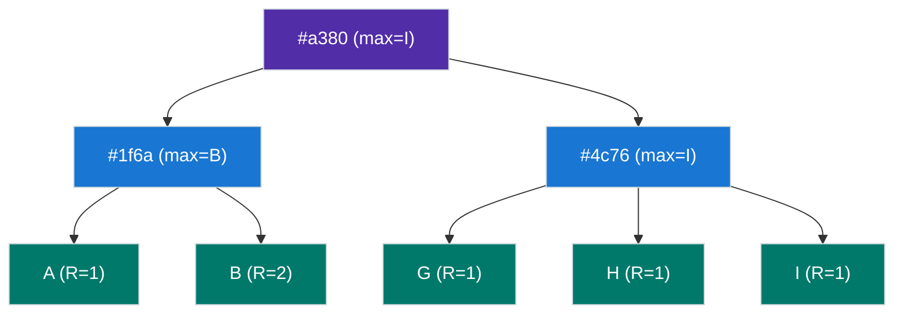
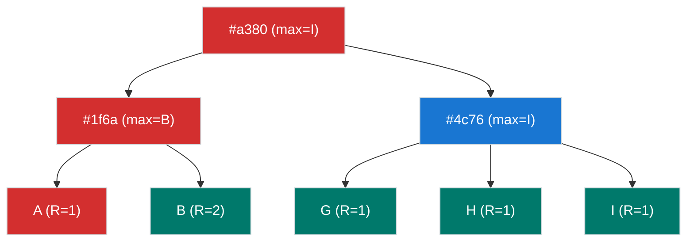
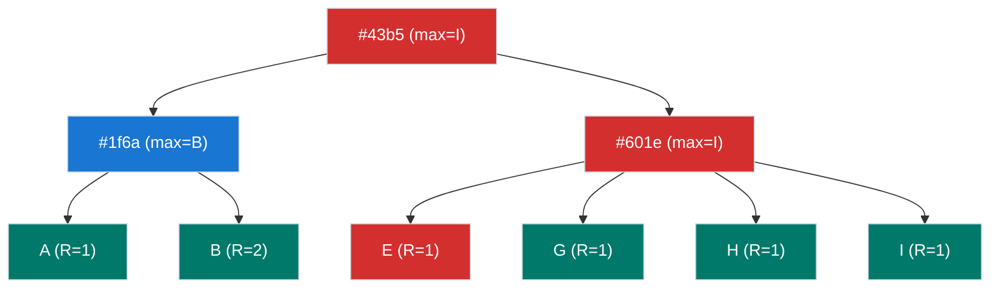

# ranked-prolly-tree


`ranked-prolly-tree` (RPT) is a key-value store implemented as a [prolly tree], utilizing a flexible content-addressed block storage backend. RPT is designed to be the foundation of a passive database, providing on demand partial replication.

## Usage

```rust
use ranked_prolly_tree::{Tree, Result};

#[tokio::main]
async fn main() -> Result<()> {
    let mut tree = Tree::<64, _>::default();
    let hello = String::from("hello").into_bytes();
    let world = String::from("world").into_bytes();
    tree.set(hello.clone(), world.clone()).await?;
    assert_eq!(tree.get(&hello).await?.unwrap(), world);
    Ok(())
}
```

## Support

|                       | native | wasm32 browser |
| :-------------------- | -----: | -------------: |
| [`MemoryStore`]       |   ✅   |       ✅       |
| [`SyncMemoryStore`]   |   ✅   |       ✅       |
| [`FileSystemStore`]   |   ✅   |       ❌       |
| [`IndexedDbStore`]    |   ❌   |       ✅       |

## Design

RPT is the basis for a passive database that efficiently hydrates from a remote block store. Repeatedly requesting data from a server incurs overhead, and we attempt to cache ahead data to reduce latency in future queries, especially when accessing nearby key ranges.

RPT is a [prolly tree] implementation where nodes are represented by a *block* in a block store. The bottom level contains **leaf** (💚) nodes, which represent key/value pairs, ordered by their keys, and are always at the same level. **Segments** (💙) are parents of leaf nodes. **Branches** (💜) are nodes whose children are either segments or other branches.

An example tree of 5 entries (with keys A, B, G, H, I, values omitted) and their rank, and segment and branches with the maximum key, or the largest/right-most key in their descendants:



Nodes are encoded as blocks in the block store, keyed by the hash of the block. **Branches** encode tuples of each child's hash and their boundary/largest key. **Segments** encode tuples of each leaf child's key and value, inlining leaf nodes, such that leaf nodes are not directly addressable from the block store. This strategy allows efficient, lazy lookups, and opportunistic preemptive caching.

### Qualities

* Partial on demand replication: A tree can be lazily hydrated from a tree root hash and (possibly remote) block store, loading nodes as needed.
* History independent: Trees containing identical data always arrive at the same shape/root hash, regardless of the order of operations.
* Non-destructive: As the nodes are represented as blocks in storage, modifying a tree creates new blocks, such that writes do not invalidate previous tree states.
* Verifiable: As a [merkle tree], each node's hash is comprised of its children hashes, allowing verification of data from the storage layer.

### Ranking

Instead of a boundary function used in prolly trees, we use a ranking function (via [Geometric Search Trees]) to determine ranks of leaf nodes based on their key. At each level in the tree, if a rank is higher than the current rank, a boundary is created. Note the example above, where the leaf with key `B` is rank 2. This creates a boundary, and subsequent leaves have a different parent. Ranks are recursively applied upward, creating new nodes as needed.

Ranking is dependent on desired branching factor (`P` in `Tree<P, _>`), where ranks probabilistically approach each node having approximately `P` children.

> [!NOTE]  
> In practice, the range for the ranking function is a bit wide, e.g. a ranking factor of 64 could have nodes with 3x as many children. Investigating context-based boundary alternatives, like Dolt's [prolly tree]. 

### Operations

#### Get

Retrieving a value requires traversing number of nodes corresponding to tree height. In the following example, querying for key `A` from the root, if the key exists it must be within the `#1f6a` node, as it's less than its boundary of `B`. Since `#1f6a` is a segment, all the children are ordered and available, and an entry with key `A` can be quickly found if it exists. 



### Set

Setting a value traverses at most *HEIGHT* nodes, descending similarly to getting a value, and either finds an existing entry with the same key, or where in the tree the entry would need to be inserted to maintain order.

In the following example, an entry with key `E` is inserted, which has a computed rank of 1. No new boundary is created, but the blocks of the root and the segment have been updated.



## Benchmarks

Benchmarks can be found at [BENCHMARKS.md](BENCHMARKS.md).

[prolly tree]: https://www.dolthub.com/blog/2024-03-03-prolly-trees/
[Geometric Search Trees]: https://g-trees.github.io/g_trees/
[merkle tree]: https://en.wikipedia.org/wiki/Merkle_tree
